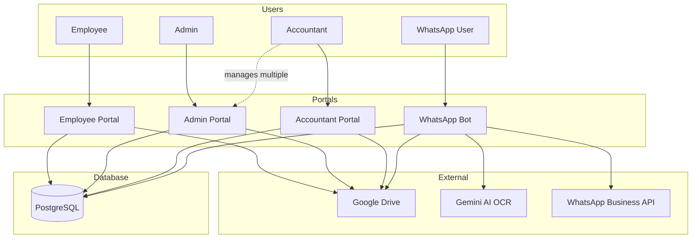
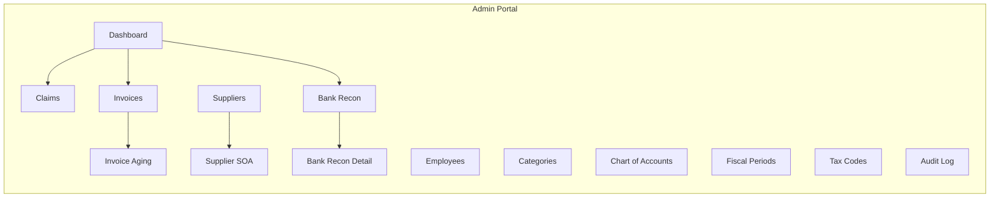
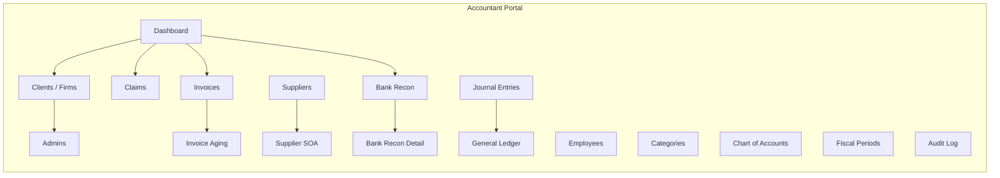
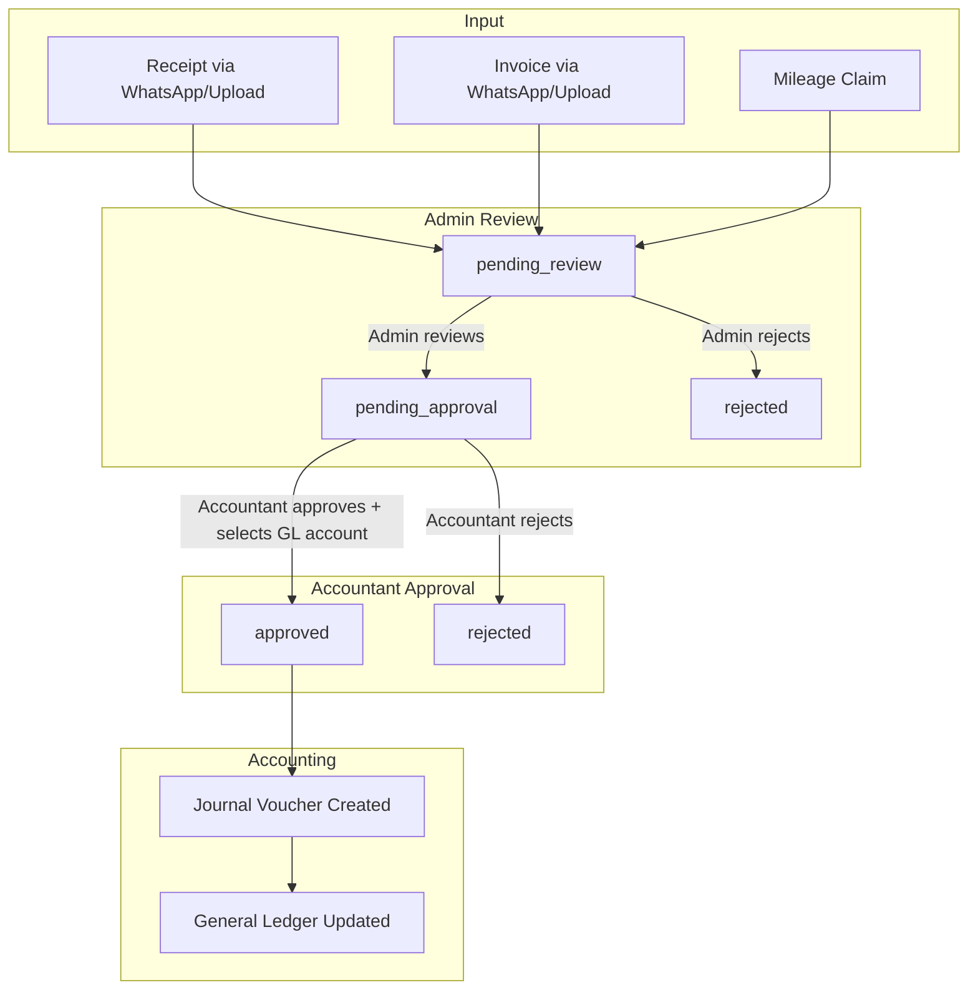
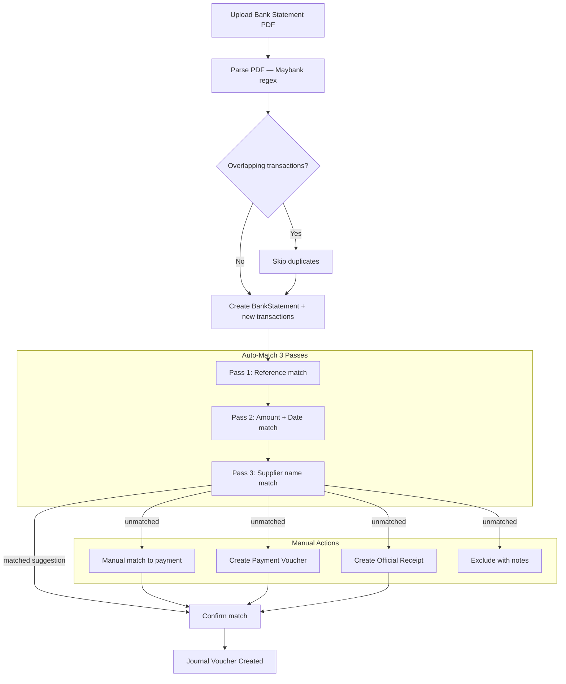
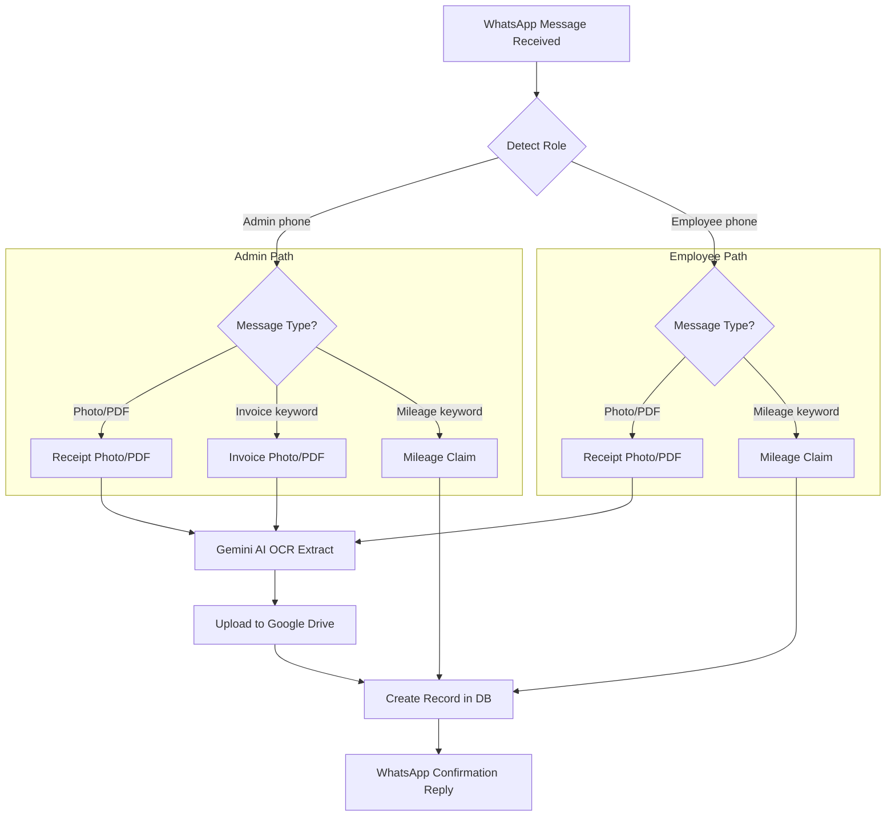
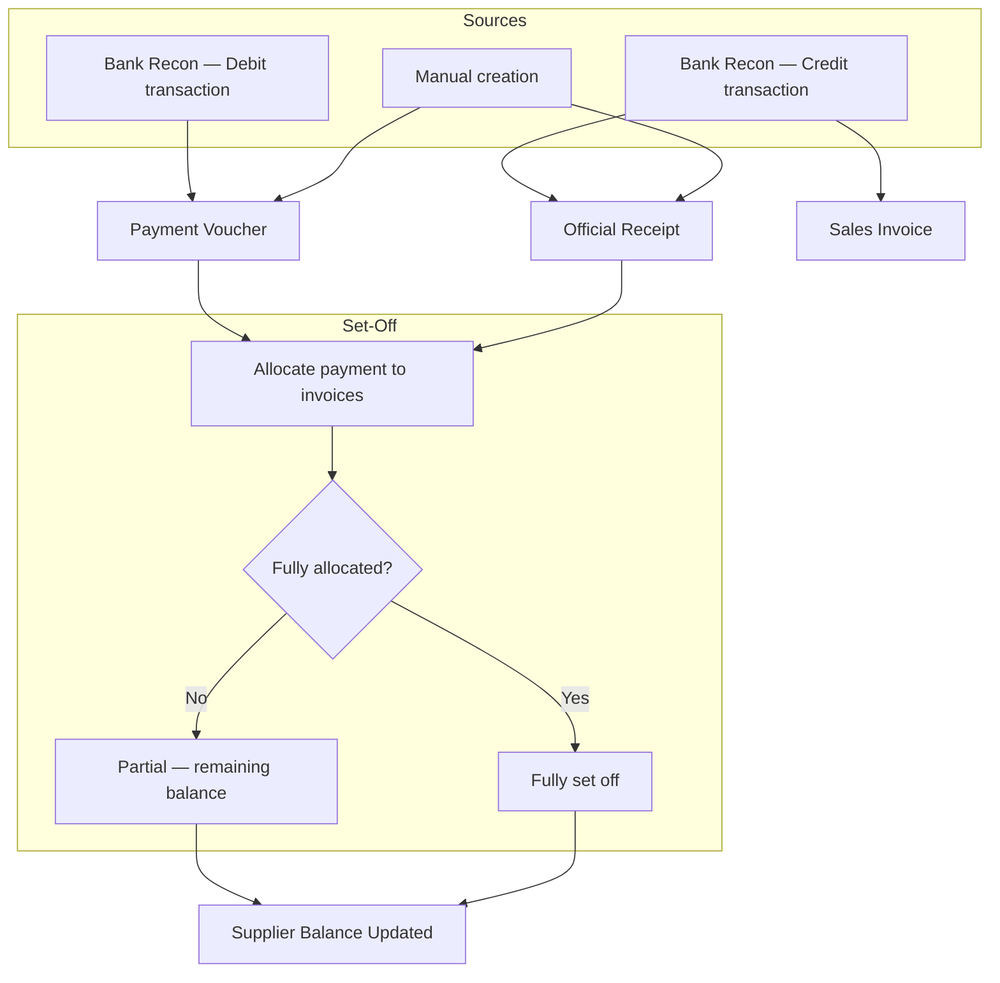
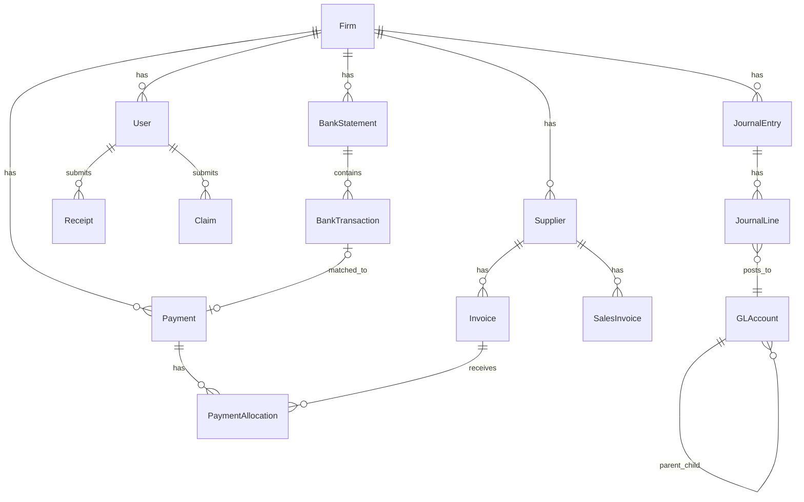

# Autosettle System Diagrams (Mermaid)

Paste each diagram into Excalidraw via: Menu → Insert → Mermaid

---

## 1. System Overview — Portals & Roles

---

## 2. Admin Portal Pages

---

## 3. Accountant Portal Pages

---

## 4. Document → Approval → JV Flow

---

## 5. Bank Reconciliation Flow

---

## 6. WhatsApp Bot Flow

---

## 7. Payment & Set-Off Flow

---

## 8. Data Model — Key Tables

